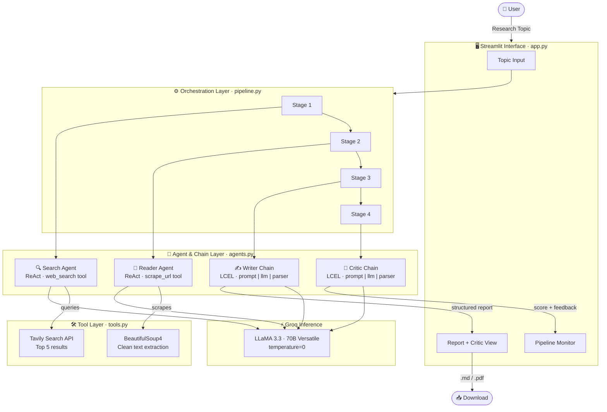

# CrawlForge — Multi-Agent Research Intelligence System

<p align="center">
  
  
  
  
  
  
  
</p>

> **CrawlForge** is an autonomous, multi-agent AI research system that deploys four specialized agents in a sequential pipeline — web search, deep content extraction, structured report writing, and quality critique — to deliver comprehensive research reports on any topic.


## Overview

CrawlForge addresses a fundamental challenge in modern research workflows: the fragmentation of information retrieval, synthesis, and quality assurance across multiple tools and manual steps. By chaining four specialized AI agents — each with a discrete role — CrawlForge automates the entire research pipeline from raw query to publishable report.

The system is built on the **ReAct (Reasoning + Acting)** agentic paradigm, where each agent is equipped with domain-specific tools and guided by a focused system prompt. Agents communicate through LangChain's message-passing interface, with outputs from upstream agents feeding as context into downstream ones.

The Streamlit front-end renders the pipeline in real time with an editorial terminal aesthetic, providing live status indicators for each stage and export options in both Markdown and styled PDF formats.

---

## System Architecture

### High-Level Pipeline



---

## Agent Pipeline

### Stage 1 — Search Agent
**Role:** Web Intelligence Retrieval

The Search Agent uses the Tavily Search API to retrieve the top 5 most relevant, recent, and authoritative sources for the given topic. It returns structured output containing titles, URLs, and content snippets for each result. Built using LangChain's `create_react_agent` with the `web_search` tool.

### Stage 2 — Reader Agent
**Role:** Deep Content Extraction

The Reader Agent receives the Search Agent's output, selects the single most relevant URL using LLM reasoning, and scrapes its full-text content using `requests` and `BeautifulSoup4`. JavaScript, navigation, and footer elements are stripped to isolate meaningful prose. Returns up to 3,000 characters of clean extracted text.

### Stage 3 — Writer Chain
**Role:** Structured Report Synthesis

A LangChain LCEL (LangChain Expression Language) chain that combines search results and scraped content into a single research context, then prompts `llama-3.3-70b-versatile` via Groq to produce a structured report. The report template mandates: Introduction, Key Findings (minimum 3), Conclusion, and Sources.

### Stage 4 — Critic Chain
**Role:** Quality Evaluation

An independent LCEL chain that evaluates the generated report against a structured rubric, returning a numerical score out of 10, enumerated strengths, areas for improvement, and a one-line verdict.

---

## Tech Stack

| Layer | Technology | Purpose |
|---|---|---|
| LLM Backend | Groq — LLaMA 3.3 70B Versatile | Inference engine for all chains |
| Agent Framework | LangChain 0.3 | Agent construction, tool binding, LCEL chains |
| Web Search | Tavily API | Semantic, real-time web retrieval |
| Web Scraping | Requests + BeautifulSoup4 | HTML parsing and content extraction |
| UI Framework | Streamlit | Interactive front-end and pipeline monitor |
| PDF Export | ReportLab | Programmatic editorial PDF generation |
| Observability | LangSmith | Pipeline tracing, latency, and token monitoring |
| Environment | python-dotenv | Secrets management |

---

## Project Structure

```
multi-agent-research-system/
├── app.py              # Streamlit UI, pipeline orchestration, PDF export
├── agents.py           # Agent builders (Search, Reader) + Writer/Critic chains
├── pipeline.py         # CLI pipeline runner with console output
├── tools.py            # LangChain tools: web_search, scrape_url
├── requirements.txt    # Python dependencies
├── .env                # API keys (not committed to version control)
├── .gitignore
├── render.yaml
└── README.md
```

### File Responsibilities

**`tools.py`** — Defines two `@tool`-decorated functions that LangChain agents can invoke. `web_search` wraps the Tavily client. `scrape_url` performs HTTP GET requests with a browser User-Agent and returns stripped plain text.

**`agents.py`** — Instantiates the Groq LLM at temperature 0 for deterministic output. `build_search_agent()` and `build_reader_agent()` each wrap the LLM and a single tool inside a ReAct agent. `writer_chain` and `critic_chain` are pure LCEL pipes: `prompt | llm | StrOutputParser()`.

**`pipeline.py`** — Headless CLI runner that executes all four stages sequentially and prints intermediate outputs. Useful for debugging or batch processing without the Streamlit UI.

**`app.py`** — Full Streamlit application. Manages session state across reruns, renders the four-stage pipeline monitor via an iframe component, streams agent outputs to the UI, and handles both Markdown and PDF download buttons. The PDF export function uses ReportLab to produce a publication-quality document with a branded cover page.

---

## Installation & Setup

### Prerequisites

- Python 3.10 or higher
- pip
- A Groq API key (free at [console.groq.com](https://console.groq.com))
- A Tavily API key (free at [tavily.com](https://tavily.com))
- A LangSmith API key (free at [smith.langchain.com](https://smith.langchain.com))

### Steps

```bash
# 1. Clone the repository
git clone https://github.com/YOUR_USERNAME/crawlforge.git
cd crawlforge

# 2. Create and activate a virtual environment
python -m venv .venv

# On macOS/Linux:
source .venv/bin/activate

# On Windows:
.venv\Scripts\activate

# 3. Install dependencies
pip install -r requirements.txt
```

---

## Environment Variables

Create a `.env` file in the project root with the following keys:

```env
GROQ_API_KEY=your_groq_api_key_here
TAVILY_API_KEY=your_tavily_api_key_here
LANGCHAIN_API_KEY=your_langsmith_api_key_here
LANGCHAIN_TRACING_V2=true
LANGCHAIN_PROJECT=CrawlForge
```

> **Security Note:** The `.env` file is listed in `.gitignore` and must never be committed to version control. When deploying to cloud platforms, set these as environment secrets rather than file-based variables.

---

## Running the Application

### Streamlit Web Interface

```bash
streamlit run app.py
```

The application will be available at `http://localhost:8501`. Enter any research topic in the input field and click **EXECUTE →** to begin the pipeline.

### CLI Mode

```bash
python pipeline.py
```

Prompts for a topic in the terminal and prints all intermediate agent outputs and the final report to stdout.

---

## LangSmith Tracing

CrawlForge integrates with [LangSmith](https://smith.langchain.com) for full pipeline observability. Every run is automatically traced — showing each agent's inputs, outputs, latency, and token usage — with no code changes required beyond setting the environment variables above.

### Viewing Traces

1. Go to [smith.langchain.com](https://smith.langchain.com) and log in
2. In the left sidebar, look for a project called **CrawlForge**
3. Click it — you'll see a trace for every pipeline run, with each of the four stages (Search → Reader → Writer → Critic) visible as a chain you can click through to inspect individually

> **Note:** Make sure `LANGCHAIN_API_KEY` is present in your `.env` file. Without it, traces won't appear even if `LANGCHAIN_TRACING_V2=true` is set.

### What Gets Traced

Each pipeline run produces a single top-level trace broken into four child spans:

| Span | Agent | Captured Data |
|---|---|---|
| Stage 1 | Search Agent | Tavily query, top 5 results, token count |
| Stage 2 | Reader Agent | Selected URL, scraped content, latency |
| Stage 3 | Writer Chain | Full prompt context, generated report |
| Stage 4 | Critic Chain | Report input, score, strengths, verdict |

---

## CLI Usage

```
$ python pipeline.py

 Enter a research topic : transformer attention mechanisms

 ==================================================
step 1 - search agent is working ...
==================================================
 search result  Title: Attention Is All You Need...

 ==================================================
step 2 - Reader agent is scraping top resources ...
==================================================
scraped content:
...

 ==================================================
step 3 - Writer is drafting the report ...
==================================================

 ==================================================
step 4 - critic is reviewing the report
==================================================
 critic report
 Score: 8/10
 Strengths: ...
```

---

## Features

- **Four-stage autonomous pipeline** with real-time Streamlit status indicators
- **Live web search** via Tavily for up-to-date, relevant sources
- **Deep content extraction** with noise filtering (scripts, navbars, footers removed)
- **Structured report generation** with enforced section schema
- **Independent quality critique** with scored evaluation rubric
- **LangSmith tracing** — full per-run observability with latency and token metrics
- **Markdown export** — download the report as a `.md` file
- **PDF export** — editorial-quality PDF with branded cover page, section badges, and page numbers (generated entirely in Python via ReportLab)
- **Session state persistence** — results persist across Streamlit reruns within the same session
- **Raw agent output inspector** — collapsible debug panels showing unprocessed agent responses
- **Fully typed, modular codebase** — agents, tools, UI, and pipeline are cleanly separated

---

## Output Formats

### Markdown Report (`.md`)
Plain-text structured report with headings, bullet points, and source URLs. Suitable for further editing in any Markdown-compatible editor.

### PDF Report (`.pdf`)
Programmatically generated using ReportLab with:
- Branded cover page with topic box, generation timestamp, and author credit
- Per-section numbered badges
- Sidebar accent bars on headings
- Diamond bullet points for list items
- Page numbers with footer branding
- Warm editorial color palette (#d4820a amber, #f0e6c8 off-white, #080808 near-black)

---

## Deployment

### Deploy to Render

Render detects Python web services automatically and requires two small configuration files in the project root.

**Step 1 — Add a `render.yaml` file**

```yaml
services:
  - type: web
    name: crawlforge
    runtime: python
    buildCommand: pip install -r requirements.txt
    startCommand: streamlit run app.py --server.port $PORT --server.address 0.0.0.0 --server.headless true
    envVars:
      - key: GROQ_API_KEY
        sync: false
      - key: TAVILY_API_KEY
        sync: false
      - key: LANGCHAIN_API_KEY
        sync: false
      - key: LANGCHAIN_TRACING_V2
        value: "true"
      - key: LANGCHAIN_PROJECT
        value: "CrawlForge"
```

**Step 2 — Push to GitHub**

Make sure `.env` is in `.gitignore` — never commit API keys.

**Step 3 — Create the service on Render**

1. Go to [render.com](https://render.com) and sign in
2. Click **New → Web Service** and connect your GitHub repository
3. Render will auto-detect the `render.yaml` — confirm the settings
4. Under **Environment**, add your secrets:
   - `GROQ_API_KEY` → your Groq key
   - `TAVILY_API_KEY` → your Tavily key
   - `LANGCHAIN_API_KEY` → your LangSmith key
5. Click **Create Web Service**

Render will build and deploy automatically. Every push to `main` triggers a redeploy.

> The `python-dotenv` `load_dotenv()` calls in the codebase are harmlessly ignored on Render — environment variables are injected directly by the platform, so no code changes are needed.

---

## `requirements.txt` Reference

Ensure your `requirements.txt` includes at minimum:

```
streamlit
langchain
langchain-groq
langchain-core
langgraph
tavily-python
requests
beautifulsoup4
python-dotenv
reportlab
rich
langsmith
```

---

## Author

**Laiba Mushtaq**  
NED University of Engineering & Technology  

---

*CrawlForge — Research, Forged.*
